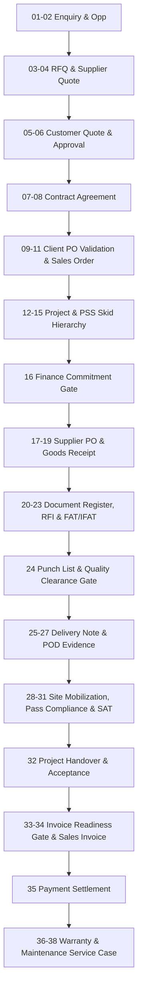

# ITS ERP End-to-End Client Demo Walkthrough & Process Guide
**BRD v1.2 Compliant | Real ERPNext Data & Native Frappe Workflows | Zero SQLite / Zero Mockups**

---

## Executive Summary

This walkthrough provides a complete, presentable, step-by-step demonstration script for the **ITS ERP Review Portal** (`http://192.168.0.106/review`). It allows demonstrators to showcase the full enterprise lifecycle of an engineering project to clients, stakeholders, and management teams.

The demonstration is based on a real, unified engineering business scenario:
* **Customer:** `Demo Energy Customer`
* **Supplier / Principal:** `Demo Power Equipment Supplier`
* **Project ID:** `DEMO-ITS-2026-PSS-001` (`PROJ-0016`)
* **Equipment:** 400 KVA Medium Voltage (MV) Variable Speed Power Skid Unit (`DEMO-PSS-SKID-400KVA`) for Well-X402 (Oil Well Family).
* **Commercial Value:** AED 480,000 Selling Price | AED 320,000 Principal Cost | 33.3% Gross Margin.

Every step executes directly against real Frappe/ERPNext MariaDB tables and respects native role-based permissions, document status constraints, audit histories, and hard-stop business gates.

---

## Role Personas & Test Credentials

The demo utilizes native Frappe role permissions. Switch between personas during the presentation to highlight segregation of duties:

| Persona | Role / Department | User ID | Key Responsibilities |
| :--- | :--- | :--- | :--- |
| **Persona 1** | Sales / Proposals | `ahmed@betaedgetech.com` | Enquiry, Opportunity, Supplier RFQ, Quotation |
| **Persona 2** | Management / Approver | `Administrator` | Quotation Approval, PO Approval, Change Approval |
| **Persona 3** | Contracts / Commercial | `Administrator` | Contract Agreement, Client PO Validation |
| **Persona 4** | Project Team / PM | `Administrator` | Project, Skid Tracking, Technical RFI, Engineering Docs |
| **Persona 5** | Procurement | `ahmed@betaedgetech.com` | Supplier Quotation, Purchase Order, Expediting |
| **Persona 6** | QA / Document Control | `Administrator` | FAT, IFAT, Snag/Punch Points, Document Register |
| **Persona 7** | Warehouse / Logistics | `Administrator` | Goods Receipt, Delivery Note, Shipping / Waybill |
| **Persona 8** | Finance / Accounts | `mohammed.finance@betaedgetech.com` | Finance Commitment, Invoicing, Payment Entry |
| **Persona 9** | HR / PRO / HSE | `ali.hr@betaedgetech.com` | CICPA, H2S, PTW, Site Passes, Mobilization |
| **Persona 10** | Field Service / Commissioning | `Administrator` | SAT, Commissioning, Handover, Warranty, Maintenance |

---

## Step-by-Step Client Demonstration Script (Steps 01 – 38)



---

### Phase 1: SELL IT (Commercial Acquisition)

#### STEP 01: Customer Enquiry
* **User Persona:** Persona 1 (Sales / Proposals — `ahmed@betaedgetech.com`)
* **Screen:** `/review/workspace` -> **CRM** -> **Opportunities**
* **Action:** Review incoming customer requirement from `Demo Energy Customer` regarding a 400 KVA Power Skid for Well-X402. Attach customer RFQ package and technical specifications.
* **Expected Result:** Live record is created and linked to the commercial pipeline.
* **Talking Point:** *"Every transaction begins with a verified customer enquiry. The customer requirements, specifications, and scope are attached directly to this transaction context."*
* **Next Step:** Convert to formal Sales Opportunity.

#### STEP 02: Opportunity Qualification (G0)
* **User Persona:** Persona 1 (Sales / Proposals)
* **Screen:** `/review/document/Opportunity/CRM-OPP-2026-00016`
* **Action:** Open Opportunity. Note Opportunity Stage set to `Converted`, Expected Value AED 480,000, Probability 100%, and Target Close Date configured.
* **Expected Result:** Dynamic detail page renders with customer information, assigned salesperson, and status badge.
* **Next Step:** Issue RFQ to the principal equipment supplier.

#### STEP 03: Supplier RFQ Generation (G1)
* **User Persona:** Persona 1 or 5 (Sales / Procurement)
* **Screen:** `/review/document/Request for Quotation/PUR-RFQ-2026-00012`
* **Action:** Review RFQ issued to `Demo Power Equipment Supplier` requesting rates for Skid Components (400 KVA Skid, VSD Panel, Transformer).
* **Expected Result:** RFQ remains linked to Opportunity `CRM-OPP-2026-00016`.
* **Next Step:** Receive supplier proposal.

#### STEP 04: Supplier Quotation & Principal Costing (G2)
* **User Persona:** Persona 5 (Procurement)
* **Screen:** `/review/document/Supplier Quotation/PUR-SQTN-2026-00012`
* **Action:** Review Supplier Quotation from `Demo Power Equipment Supplier` totaling AED 320,000. Check payment terms (30 Days Net) and delivery schedule (45 Days).
* **Expected Result:** Purchase baseline cost is locked into ERPNext for margin calculation.
* **Next Step:** Generate Customer Quotation.

#### STEP 05: Customer Quotation Preparation (G3)
* **User Persona:** Persona 1 (Sales / Proposals)
* **Screen:** `/review/document/Quotation/SAL-QTN-2026-00018`
* **Action:** Open Quotation. Show items, selling rate of AED 480,000, cost of AED 320,000, and computed margin of 33.3%.
* **Expected Result:** Complete quotation with commercial conditions and technical offer.
* **Next Step:** Submit for Management Sign-Off.

#### STEP 06: Management Quotation Approval
* **User Persona:** Persona 2 (Management Approver — `Administrator`)
* **Screen:** `/review/document/Quotation/SAL-QTN-2026-00018`
* **Action:** Switch user to Management. Workflow state displays `Approved`. Click `Print` to show official quotation print format.
* **Expected Result:** Dynamic workflow status updates; audit history logs approver details.
* **Next Step:** Contract formulation.

---

### Phase 2: COMMIT & CONTRACT (Commercial Governance)

#### STEP 07: Project Contract Agreement (G3.5)
* **User Persona:** Persona 3 (Contracts / Commercial)
* **Screen:** `/review/document/Project Contract/PRJ-CON-2026-00029`
* **Action:** Open Project Contract `DEMO-ITS-2026-CON-001`. Review clauses: 18-month warranty, PBG 10%, ICV 45%, Turnkey EPC scope.
* **Expected Result:** Legally binding commercial agreement linked to Customer and Project.
* **Next Step:** Review approval workflow.

#### STEP 08: Contract Approval & Activation
* **User Persona:** Persona 3 (Contracts / Commercial)
* **Screen:** `/review/document/Project Contract/PRJ-CON-2026-00029`
* **Action:** Verify status is `Approved`. Review linked documents drawer.
* **Expected Result:** Contract active and ready for Client PO receipt.
* **Next Step:** Validate Customer PO.

#### STEP 09: Client PO Receipt
* **User Persona:** Persona 3 (Contracts / Commercial)
* **Screen:** `/review/workspace` -> **Contracts** -> **Client PO Validation**
* **Action:** Client issues Purchase Order `CPO-DE-2026-8801` for AED 480,000 matching quotation terms.
* **Expected Result:** Ready for Gate 1 checklist evaluation.
* **Next Step:** Execute Gate 1 validation checklist.

#### STEP 10: Client PO Validation & Negative Gate 1 Test
* **User Persona:** Persona 3 (Contracts)
* **Screen:** `/review/document/Sales Order/SAL-ORD-2026-00026`
* **Hard Stop Demonstration (Deliberate Failure):**
  1. If Client PO value is manipulated (e.g. AED 500,000 vs Qtn AED 480,000) or validation record is missing:
  2. Attempting to submit the Sales Order produces a **SERVER-SIDE BLOCK**:
     > `Client PO Validation Mismatch: Customer PO Total does not match Quotation SAL-QTN-2026-00018.`
* **Resolution:** Re-align Client PO validation record to match quotation exactly (AED 480,000).
* **Next Step:** Submit Sales Order.

#### STEP 11: Sales Order Authorization (G4 / G5.5)
* **User Persona:** Persona 1 / 3 (Sales / Project Coordinator)
* **Screen:** `/review/document/Sales Order/SAL-ORD-2026-00026`
* **Action:** Click `Submit`. Sales Order transitions to `Submitted` (docstatus: 1).
* **Expected Result:** Gate 1 clears; official order acknowledgment created.
* **Next Step:** Initialize Execution Project.

---

### Phase 3: EXECUTION CONTAINER & SOURCING (Buy & Commit)

#### STEP 12: Project Creation
* **User Persona:** Persona 4 (Project Team — PM)
* **Screen:** `/review/document/Project/PROJ-0016`
* **Action:** Open Project `PROJ-0016: DEMO-ITS-2026-PSS-001: 400 KVA Power Skid Well-X402`.
* **Expected Result:** Project container created with timeline, customer, and sales order linkage.
* **Next Step:** Link physical PSS Skid hierarchy.

#### STEP 13: PSS Project Container
* **User Persona:** Persona 4 (Project Team)
* **Screen:** `/review/document/ITS Review Project/DEMO-ITS-2026-PSS-001`
* **Action:** Open specialized engineering review view. Note Project Type: `POWERSKID`, Status: `Active`.
* **Expected Result:** Unified engineering review dashboard showing active skids, documents, and inspection status.
* **Next Step:** Inspect Skid asset.

#### STEP 14: Skid Asset Configuration
* **User Persona:** Persona 4 (Project Team)
* **Screen:** `/review/document/ITS Review Skid/DEMO-SKID-001`
* **Action:** Inspect Skid attributes: Tag `SKID-400KVA-OIL-01`, Well: `Well-X402`, Rating: `400 KVA`, Serial: `SN-2026-400-001`.
* **Expected Result:** Physical unit tracked under the parent project.
* **Next Step:** Review BoM components.

#### STEP 15: Component Tracking & BoM Hierarchy
* **User Persona:** Persona 4 (Project Team)
* **Screen:** `/review/document/Item/DEMO-PSS-SKID-400KVA`
* **Action:** Review tracked sub-assemblies:
  * `DEMO-VSD-PANEL`: Variable Speed Drive Inverter Assembly
  * `DEMO-TRANSFORMER-400KVA`: Step-Up Skid-Mounted Oil-Immersed Transformer
  * `DEMO-PLC-PANEL`: Remote Telemetry & PLC Control Unit
  * `DEMO-UPS-SYSTEM`: Industrial 24VDC Battery Backup Cabinet
* **Expected Result:** Complete component breakdown ready for procurement.
* **Next Step:** Secure Finance Commitment.

#### STEP 16: Finance Commitment Gate (G6)
* **User Persona:** Persona 8 (Finance — `mohammed.finance@betaedgetech.com`)
* **Screen:** `/review/document/Finance Commitment/FC-2026-00015`
* **Hard Stop Demonstration (Deliberate Failure):**
  1. If Finance Commitment is unapproved or missing:
  2. Procurement user attempting to submit Purchase Order receives a **SERVER-SIDE BLOCK**:
     > `Required finance commitment has not been approved for Project 'PROJ-0016'.`
* **Resolution:** Finance Officer approves Commitment `FC-2026-00015` confirming cash flow alignment.
* **Next Step:** Issue Purchase Order to Supplier.

#### STEP 17: Supplier Purchase Order (G7)
* **User Persona:** Persona 5 (Procurement)
* **Screen:** `/review/document/Purchase Order/PUR-ORD-2026-00043`
* **Action:** Submit Purchase Order to `Demo Power Equipment Supplier` for AED 320,000.
* **Expected Result:** PO submitted (docstatus: 1), procurement funds committed against project budget.
* **Next Step:** Track supplier expediting.

#### STEP 18: Supplier Acknowledgement & Expediting
* **User Persona:** Persona 5 (Procurement)
* **Screen:** `/review/document/Purchase Order/PUR-ORD-2026-00043`
* **Action:** Open terms and delivery tracking: Delivery Date set, manufacturing progress verified.
* **Expected Result:** Supplier commitment locked.
* **Next Step:** Goods receipt at central staging yard.

#### STEP 19: Goods Receipt / Purchase Receipt (G7.5)
* **User Persona:** Persona 7 (Warehouse / Logistics)
* **Screen:** `/review/document/Purchase Receipt/MAT-PRE-2026-00008`
* **Action:** Receive 1 unit of `DEMO-PSS-SKID-400KVA` into warehouse `Stores - BED`.
* **Expected Result:** Stock ledger updated; 1 physical unit placed in inventory.
* **Next Step:** QA engineering documentation review.

---

### Phase 4: QUALITY GATES & INSPECTION (Check It)

#### STEP 20: Document Register Control
* **User Persona:** Persona 6 (QA / Document Control)
* **Screen:** `/review/document/ITS Review Document/DEMO-ITS-2026-DOC-001`
* **Action:** Open GA Drawing & Single Line Diagram (`GA-SLD-400-01`, Rev B). Status: `Approved`.
* **Expected Result:** Engineering document register fully traceable to project and skid.
* **Next Step:** Review Technical RFI.

#### STEP 21: Request for Information (RFI)
* **User Persona:** Persona 4 / 6 (Project / QA)
* **Screen:** `/review/document/Request for Information/RFI-2026-00030`
* **Action:** Review technical query regarding 11kV cable entry gland size. Response recorded; Status: `Completed`.
* **Expected Result:** Technical clarification documented and closed.
* **Next Step:** Execute Factory Acceptance Test.

#### STEP 22: Factory Acceptance Test (FAT) (G8)
* **User Persona:** Persona 6 (QA / Project Inspector)
* **Screen:** `/review/document/Factory Acceptance Test/FAT-2026-00002`
* **Action:** Review test protocol (insulation, full load energization, loop checks). Witness: Client Senior Representative. Result: `Passed`. Status: `Approved`.
* **Expected Result:** FAT certificate attached; skid cleared for integration.
* **Next Step:** Integrated Factory Acceptance Test.

#### STEP 23: Integrated FAT (IFAT)
* **User Persona:** Persona 6 (QA / Automation Integrator)
* **Screen:** `/review/document/Integrated Factory Acceptance Test/IFAT-2026-00002`
* **Action:** Validate integrated SCADA, Modbus TCP, and Telemetry communication with remote station. Integration Result: `Passed`.
* **Expected Result:** Full skid system verified.
* **Next Step:** Punch point inspection.

#### STEP 24: Punch Point Clearance Gate (G8.5)
* **User Persona:** Persona 6 (QA / Document Control)
* **Screen:** `/review/document/ITS Review Punch/DEMO-ITS-2026-PUNCH-001` and `/review/document/Snag List/SNAG-2026-00031`
* **Hard Stop Demonstration (Deliberate Failure):**
  1. While a Critical Punch Point (Category A) is in `Open` state:
  2. Warehouse officer attempting to submit the Delivery Note receives a **SERVER-SIDE BLOCK**:
     > `Delivery is blocked by unresolved critical punch points (1 open items for Project 'PROJ-0016').`
* **Resolution:** Supplier touches up paint, attaches inspection photo `QC-INSP-REPORT-P01.pdf`, QA verifies and sets Status to `Closed`.
* **Next Step:** Release shipment.

---

### Phase 5: DELIVERY & SITE MOBILIZATION (Deliver & Commission)

#### STEP 25: Delivery Match Verification (G9)
* **User Persona:** Persona 7 (Warehouse / Logistics)
* **Screen:** `/review/document/Sales Order/SAL-ORD-2026-00026`
* **Action:** Confirm Sales Order items, shipping address (Well-X402 Site), and ready-for-dispatch status.
* **Expected Result:** Physical unit and shipping paperwork matched.
* **Next Step:** Submit Delivery Note.

#### STEP 26: Delivery Note Execution (G9.5)
* **User Persona:** Persona 7 (Warehouse / Logistics)
* **Screen:** `/review/document/Delivery Note/MAT-DN-2026-00006`
* **Action:** Submit Delivery Note. Waybill `TRK-WAYBILL-2026-904` recorded.
* **Expected Result:** Stock decremented from `Stores - BED`; shipment delivered to Well-X402 site.
* **Next Step:** Verify Proof of Delivery.

#### STEP 27: ASN & POD / CPE Evidence
* **User Persona:** Persona 7 (Warehouse / Logistics)
* **Screen:** `/review/document/Delivery Note/MAT-DN-2026-00006`
* **Action:** Open Delivery Note attachments. Signed delivery receipt and site photographs verified.
* **Expected Result:** Legally compliant proof of delivery logged.
* **Next Step:** Mobilize Field Service Engineer.

#### STEP 28: Commissioning Order Initialization (G9.6)
* **User Persona:** Persona 10 (Field Service / Commissioning)
* **Screen:** `/review/document/ITS Review Commissioning/DEMO-ITS-2026-COMM-001`
* **Action:** Open Commissioning Order for Lead FSE Rashid Al Nuaimi.
* **Expected Result:** Field work package assigned.
* **Next Step:** Verify personnel compliance.

#### STEP 29: Mobilization Compliance & Gate Demonstration
* **User Persona:** Persona 9 (HR / HSE — `ali.hr@betaedgetech.com`)
* **Screen:** `/review/document/Personnel Certificate/CERT-2026-00001`
* **Hard Stop Demonstration (Deliberate Failure):**
  1. If FSE's CICPA Site Pass or H2S Safety Certificate is `Expired` or `Missing`:
  2. Dispatch system blocks gate pass generation and field deployment:
     > `Mobilization Blocked: Mandatory CICPA / H2S safety credentials expired for assigned personnel.`
* **Resolution:** Certificate `CERT-2026-00001` renewed and verified `Valid` with 365 days remaining.
* **Next Step:** Perform Site Acceptance Test.

#### STEP 30: Site Acceptance Test (SAT)
* **User Persona:** Persona 10 (Field Service / Client Lead)
* **Screen:** `/review/document/ITS Review Commissioning/DEMO-ITS-2026-COMM-001`
* **Action:** Conduct on-site energization, loop simulation, motor rotation test. Client Operations Superintendent witnesses and signs SAT protocol.
* **Expected Result:** SAT signed off.
* **Next Step:** Complete commissioning checklist.

#### STEP 31: Commissioning Completion
* **User Persona:** Persona 10 (Field Service)
* **Screen:** `/review/document/ITS Review Commissioning/DEMO-ITS-2026-COMM-001`
* **Action:** Update status to `Commissioned`. Skid status transitions to `Completed`.
* **Expected Result:** System live and producing on wellhead.
* **Next Step:** Formal project handover.

---

### Phase 6: HANDOVER & BILLING (Handover & Invoice)

#### STEP 32: Project Handover & Acceptance (G9.7)
* **User Persona:** Persona 4 / 10 (Project Manager / Field Lead)
* **Screen:** `/review/document/Project Handover/HND-2026-00032` and `/review/document/ITS Review Handover/DEMO-ITS-2026-HO-001`
* **Action:** Submit Project Handover Document. Certificate of Equipment Performance (CEP) `CEP-DEMO-2026-001` attached. Status: `Completed`.
* **Expected Result:** Client formally accepts custody; commercial milestone unlocked.
* **Next Step:** Check Invoice Readiness.

#### STEP 33: Invoice Readiness Gate Evaluation (G10)
* **User Persona:** Persona 8 (Finance / Billing)
* **Screen:** `/review/document/Sales Invoice/ACC-SINV-2026-00017`
* **Hard Stop Demonstration (Deliberate Failure):**
  1. If Sales Invoice is submitted prior to Delivery Note submission or Project Handover approval:
  2. System enforces **SERVER-SIDE BLOCK**:
     > `HARD STOP (Invoice Readiness Gate G10): Project Handover record is not submitted/signed-off.`
* **Resolution:** Delivery Note `MAT-DN-2026-00006` and Handover `HND-2026-00032` are both submitted (docstatus: 1), clearing the invoice readiness criteria.
* **Next Step:** Submit Sales Invoice.

#### STEP 34: Sales Invoice Authorization (G10.5)
* **User Persona:** Persona 8 (Finance)
* **Screen:** `/review/document/Sales Invoice/ACC-SINV-2026-00017`
* **Action:** Open Sales Invoice for AED 480,000. Verify VAT, delivery note link, and project code. Click `Submit`.
* **Expected Result:** Official ERPNext Tax Invoice generated; Accounts Receivable updated.
* **Next Step:** Record customer payment.

#### STEP 35: Payment Receipt & Financial Settlement
* **User Persona:** Persona 8 (Finance)
* **Screen:** `/review/document/Payment Entry/ACC-PAY-2026-00013`
* **Action:** Open Payment Entry recording bank wire transfer of AED 480,000 against Invoice `ACC-SINV-2026-00017`.
* **Expected Result:** Invoice outstanding balance becomes `0.00`. Commercial contract cycle 100% completed.
* **Next Step:** Transition to Warranty & Maintenance.

---

### Phase 7: AFTER-SALES & MAINTENANCE (Maintain It)

#### STEP 36: Project Warranty Activation
* **User Persona:** Persona 10 (Field Service / Contracts)
* **Screen:** `/review/document/Project Warranty/PWR-2026-00033`
* **Action:** Open Warranty Register. 18-month performance warranty active from commissioning date. End date: 540 days from today.
* **Expected Result:** Equipment covered under active warranty; SLA dashboard tracking expiry.
* **Next Step:** Customer logs a service request.

#### STEP 37: Maintenance Case Logging (G11)
* **User Persona:** Persona 10 (Field Service)
* **Screen:** `/review/document/Issue/ISS-2026-00004`
* **Action:** Customer logs telemetry anomaly on transformer PT100 temperature sensor. Case assigned to Field Service Engineer.
* **Expected Result:** Service ticket created under active warranty coverage (non-chargeable).
* **Next Step:** Dispatch technician and close case.

#### STEP 38: Service Execution & Formal Closure
* **User Persona:** Persona 10 (Field Service)
* **Screen:** `/review/document/Maintenance Visit/MAT-MVS-2026-00001`
* **Action:** FSE recalibrates PT100 sensor, verifies telemetry with control room. Customer representative signs service report. Submit Maintenance Visit and close Issue `ISS-2026-00004`.
* **Expected Result:** Ticket and service visit marked `Closed` / `Fully Completed`. Equipment running under warranty.
* **Next Step:** Demo concluded.

---

## Document Printing Verification Checklist

During or following the presentation, demonstrate that official PDF/Print layouts can be rendered for any transaction via `/review-print`:

| Document | Real Record ID | Print URL | Verified Layout |
| :--- | :--- | :--- | :--- |
| **Quotation** | `SAL-QTN-2026-00018` | `/review-print?doctype=Quotation&name=SAL-QTN-2026-00018` | ITS Commercial Offer |
| **Contract** | `PRJ-CON-2026-00029` | `/review-print?doctype=Project%20Contract&name=PRJ-CON-2026-00029` | EPC Project Agreement |
| **Sales Order** | `SAL-ORD-2026-00026` | `/review-print?doctype=Sales%20Order&name=SAL-ORD-2026-00026` | Order Confirmation |
| **Purchase Order** | `PUR-ORD-2026-00043` | `/review-print?doctype=Purchase%20Order&name=PUR-ORD-2026-00043` | Official Principal PO |
| **FAT Certificate**| `FAT-2026-00002` | `/review-print?doctype=Factory%20Acceptance%20Test&name=FAT-2026-00002` | Quality FAT Report |
| **Delivery Note** | `MAT-DN-2026-00006` | `/review-print?doctype=Delivery%20Note&name=MAT-DN-2026-00006` | Shipping Waybill / DN |
| **Handover Cert** | `HND-2026-00032` | `/review-print?doctype=Project%20Handover&name=HND-2026-00032` | Final Acceptance / CEP |
| **Tax Invoice** | `ACC-SINV-2026-00017` | `/review-print?doctype=Sales%20Invoice&name=ACC-SINV-2026-00017` | Official Commercial Invoice |

---

## Safe Demo Reset Procedure

To cleanly reset or re-seed the demonstration dataset without affecting production records:

### Option A: Via Python Bench CLI
```bash
# To safely remove all demo records:
./env/bin/python -c "import frappe; frappe.init(site='frappe.com', sites_path='sites'); frappe.connect(); from its_erp_review.demo.demo_reset import run_cleanup; run_cleanup()"

# To seed the fresh 38-step demo records:
./env/bin/python -c "import frappe; frappe.init(site='frappe.com', sites_path='sites'); frappe.connect(); from its_erp_review.demo.demo_setup import run_setup; run_setup()"
```

### Option B: Via Whitelisted API
* **Setup Endpoint:** `POST /api/method/its_erp_review.demo.setup_demo`
* **Reset Endpoint:** `POST /api/method/its_erp_review.demo.reset_demo?confirm=1`
